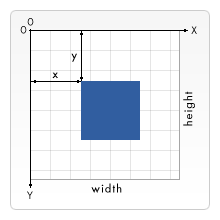

import { SelfUnderstanding, InterviewQuestion } from '@site/src/components/MDX';
import TagTable from '@site/src/components/html/tag-table';
import Tabs from '@theme/Tabs';
import TabItem from '@theme/TabItem';
import { Divider, Collapse } from "@arco-design/web-react";

> 用横线框住的区域，表示总结&记忆部分；

> 非框区域，表示官网说明内容，便于理解设计思路及原理等


# HTML5

## HTML5 定义

<SelfUnderstanding>
随着 HTML 标准迭代, HTML5 是一个较大变化的标准, 增加了较多的规范和特性, 使得 HTML 的使用与编写更加规范
</SelfUnderstanding>

<Collapse defaultActiveKey={['MDN', 'wiki']}>
<Collapse.Item header="MDN" name="MDN">

[参考链接](https://developer.mozilla.org/en-US/docs/Glossary/HTML5)

术语 HTML5 本质上是指一组现代 Web 技术的流行词汇。这包括 HTML 动态标准，以及用于增强存储、多媒体和硬件访问的 JavaScript API。

你有时会听到“新的 HTML5 元素”，或发现 HTML5 被描述为 HTML 的新版本。HTML5 是以前版本 HTML 的继任者，引入了新的元素和功能，改进或删除了一些现有功能。然而，作为动态标准，HTML 现在没有版本。最新的规范可以在
[html.spec.whatwg.org](https://html.spec.whatwg.org/) 找到。

任何现代网站都应该使用 HTML 文档类型(DOCTYPE)——这将确保你使用的是最新版本的 HTML。

</Collapse.Item>
<Collapse.Item header="维基百科" name="wiki">

[参考链接](https://zh.wikipedia.org/wiki/HTML5)

HTML5 是 HTML 最新的修订版本，由万维网联盟（W3C）于 2014 年 10 月完成标准制定。目标是取代 1999 年所制定的 HTML 4.01 和 XHTML 1.0 标准，以期能在互联网应用迅速发展的时候，使网络标准达到符合当代的网络需求。

**广义论及 HTML5 时，实际指的是包括 HTML、CSS 和 JavaScript 在内的一套技术组合**。它希望能够减少网页浏览器对于需要插件的丰富性网络应用服务（Plug-in-Based Rich Internet Application，RIA），例如：Adobe Flash、Microsoft Silverlight 与 Oracle JavaFX 的需求，并且提供更多能有效加强网络应用的标准集。

</Collapse.Item>
</Collapse>

**下述均为 HTML5 新特性。**

## 语义化

### 理解语义化


<SelfUnderstanding>
使用正确的 HTML 元素来做正确的工作。

- 利于开发：使代码**结构清晰，可读性高，方便维护**
- 利于 SEO：方便爬虫根据语义标签确定**页面结构**和**关键字**的权重
</SelfUnderstanding>

HTML 应该编写为表示将要填充的数据，而不是基于其默认的演示样式。演示（应该是什么样子），是 CSS 的唯一责任。

写语义标记的好处如下：

- 搜索引擎将其内容视为影响页面搜索排名的重要关键字（参见 [SEO](https://developer.mozilla.org/zh-CN/docs/Glossary/SEO)）。
- 屏幕阅读器可以将其用作指引，帮助视力受损的用户导航页面。
- 比起搜索无休止的带有或不带有语义/命名空间类的 div，找到有意义的代码块显然容易得多。
- 向开发人员建议将要填充的数据类型。
- 语义命名反映了正确的自定义元素/组件命名。
- 默认情况下，绝大多数浏览器的用户代理样式表会赋予语义化标签对应的样式

### 语义化标签

全量语义化[标签](https://developer.mozilla.org/zh-CN/docs/Web/HTML/Element)

<InterviewQuestion>
你在平常工作中使用过哪些语义标签？
</InterviewQuestion>

header, nav, aside, main, section, article, footer, canvas, video, audio

<TagTable />

<Tabs>
<TabItem value="main" label="main">
```jsx live
function Demo() {
  return (
    <main style={{ backgroundColor: "rgb(var(--green-1))", border:'2px solid rgb(var(--blue-5))' }}>
      <p>The Rough-skinned Newt defends itself with a deadly neurotoxin.</p>
      <p>The Rough-skinned Newt defends itself with a deadly neurotoxin.</p>
    </main>
  );
}
```
</TabItem>
<TabItem value="header" label="header">


```jsx live
function Demo() {
  return (
    <header style={{ backgroundColor: "rgb(var(--green-2))" }}>
      <b>header</b>
      <h3>h3 header text</h3>
      <time datetime="2018-07-07">July 7</time>
    </header>
  );
}
```

</TabItem>
<TabItem value="nav" label="nav">
```jsx live
function Demo() {
  return (
     <nav style={{ backgroundColor: "rgb(var(--green-3))" }}>
        <b>nav</b>, 底部 margin 是 ol 元素产生的
        <ol>
          <li>
            <a href="#">Bikes</a>
          </li>
          <li>
            <a href="#">BMX</a>
          </li>
          <li>Jump Bike 3000</li>
        </ol>
      </nav>
  );
}
```
</TabItem>
<TabItem value="article" label="article">
```jsx live
function Demo() {
  return (
     <article style={{ backgroundColor: "rgb(var(--green-4))" }}>
        <h4>2024.08.30</h4>
        <div>rainy</div>
      </article>
  );
}
```
</TabItem>

<TabItem value="section" label="section">
```jsx live
function Demo() {
  return (
    <section style={{ backgroundColor: "rgb(var(--lime-2))" }}>
      <b>section</b>
      <h3>Introduction</h3>
      <p>
        This document provides a guide to help with the important task of choosing the correct
        Apple.
      </p>
    </section>
  );
}
```
</TabItem>
<TabItem value="aside" label="aside">
```jsx live
function Demo() {
  return (
    <aside style={{ backgroundColor: "rgb(var(--lime-3))" }}>
      <p>The Rough-skinned Newt defends itself with a deadly neurotoxin.</p>
    </aside>
  );
}
```
</TabItem>
<TabItem value="details-summary" label="details-summary">
```jsx live
function Demo() {
  return (
    <div>
      <details style={{ backgroundColor: "rgb(var(--lime-4))" }}>
        <b>details</b>
        <summary>Details</summary>
        Something small enough to escape casual notice.
      </details>
      <details>单独的 details 标签</details>
      <summary style={{ backgroundColor: "rgb(var(--lime-5))" }}>单独的 summary 标签, 无三角形旋钮</summary>
    </div>
  );
}
```
</TabItem>
<TabItem value="footer" label="footer">
```jsx live
function Demo() {
  return (
    <footer style={{ backgroundColor: "rgb(var(--green-5))" }}>
      <b>footer</b>
      <div>© 2024 Gillian</div>
    </footer>
  );
}
```
</TabItem>

</Tabs>

#### canvas

> 目标: 学会如何绘制矩形，三角形，直线，圆弧和曲线, 熟悉基本形状

canvas 元素创造了一个固定大小的画布，它公开了一个或多个渲染上下文，其可以用来绘制和处理要展示的内容。我们将会将注意力放在 2D 渲染上下文中。

canvas 起初是空白的。为了展示，首先脚本需要找到渲染上下文，然后在它的上面绘制。

canvas 元素有一个叫做 getContext() 的方法，这个方法是用来获得渲染上下文和它的绘画功能。getContext()接受一个参数，即上下文的类型。

##### 画布栅格 canvas grid

画布栅格（canvas grid）以及坐标空间。上一页中的 HTML 模板中有个宽 150px, 高 150px 的 canvas 元素。

如右图所示，canvas 元素默认被网格所覆盖。通常来说网格中的一个单元相当于 canvas 元素中的一像素。
栅格的起点为左上角（坐标为（0,0））。所有元素的位置都相对于原点定位。所以图中蓝色方形左上角的坐标为距离左边（X 轴）x 像素，距离上边（Y 轴）y 像素（坐标为**(x,y)**）。
在课程的最后我们会平移原点到不同的坐标上，旋转网格以及缩放。现在我们还是使用原来的设置。

  

##### 绘制矩形

不同于 SVG，canvas 只支持两种形式的图形绘制：**矩形**和**路径**（由一系列点连成的线段）。所有其他类型的图形都是通过一条或者多条路径组合而成的。不过，我们拥有众多路径生成的方法让复杂图形的绘制成为了可能。

首先，我们回到矩形的绘制中。canvas 提供了三种方法绘制矩形：
```js
fillRect(x, y, width, height)
```
绘制一个填充的矩形
```js
strokeRect(x, y, width, height)
```
绘制一个矩形的边框
```js
clearRect(x, y, width, height)
```
清除指定矩形区域，让清除部分完全透明。

上面提供的方法之中每一个都包含了相同的参数。x 与 y 指定了在 canvas 画布上所绘制的矩形的左上角（相对于原点）的坐标。width 和 height 设置矩形的尺寸。

##### 绘制路径

图形的基本元素是路径。路径是通过不同颜色和宽度的线段或曲线相连形成的不同形状的点的集合。一个路径，甚至一个子路径，都是闭合的。使用路径绘制图形需要一些额外的步骤。

首先，你需要创建路径起始点。
然后你使用画图命令去画出路径。
之后你把路径封闭。
一旦路径生成，你就能通过描边或填充路径区域来渲染图形。
以下是所要用到的函数：

beginPath()
新建一条路径，生成之后，图形绘制命令被指向到路径上生成路径。

closePath()
闭合路径之后图形绘制命令又重新指向到上下文中。

stroke()
通过线条来绘制图形轮廓。

fill()
通过填充路径的内容区域生成实心的图形。

**生成路径的步骤:**

1. beginPath()。本质上，路径是由很多子路径构成，这些子路径都是在一个列表中，所有的子路径（线、弧形、等等）构成图形。而每次这个方法调用之后，列表清空重置，然后我们就可以重新绘制新的图形。
> 备注：当前路径为空，即调用 beginPath() 之后，或者 canvas 刚建的时候，第一条路径构造命令通常被视为是 moveTo()，无论实际上是什么。出于这个原因，你几乎总是要在设置路径之后专门**指定你的起始位置**。
2. 调用函数指定绘制路径

3. 闭合路径 closePath(), 不是必需的。这个方法会通过绘制一条从当前点到开始点的直线来闭合图形。如果图形是已经闭合了的，即当前点为开始点，该函数什么也不做。
> 备注：当你调用 fill() 函数时，所有没有闭合的形状都会自动闭合，所以你不需要调用 closePath() 函数, 但是**调用 stroke() 时不会自动闭合**。

##### 移动笔触

moveTo(x, y)
将笔触移动到指定的坐标 x 以及 y 上。当 canvas 初始化或者beginPath()调用后，你通常会使用moveTo()函数设置起点。

##### 绘制直线

lineTo(x, y)
绘制一条从当前位置到指定 x 以及 y 位置的直线。

该方法有两个参数：x 以及 y，代表坐标系中直线结束的点。开始点和之前的绘制路径有关，之前路径的结束点就是接下来的开始点，以此类推。开始点也可以通过moveTo()函数改变。

<Tabs>

<TabItem value="rect" label="绘制矩形">
```jsx live
function MediaTag(props) {
  useEffect(() => {
    const canvas = document.getElementById("myCanvas-rect"); // 得到 DOM 对象
    if (canvas.getContext) { // 检查支持性
      const ctx = canvas.getContext("2d"); // 访问绘画上下文 和 它的绘画功能

      ctx.fillStyle = "rgb(200,0,0)";
      ctx.fillRect(5, 5, 20, 30);

      ctx.fillStyle = "rgba(0, 0, 200, 0.5)"; // 有 alpha 透明度
      ctx.fillRect(15, 15, 20, 40);

      ctx.fillStyle = "rgba(200, 100, 240, 0.5)";
      ctx.fillRect(40, 10, 80, 80);
      ctx.clearRect(50, 15, 60, 60);
      ctx.strokeRect(60, 20, 30, 30);
    }
  }, []);

  return (
    <div>
      <canvas id="myCanvas-rect" width="200" height="100" style={{ border: '2px solid black' }}></canvas>
    </div>
  );
}
```
</TabItem>
<TabItem value="path" label="绘制路径">
```jsx live
function MediaTag(props) {
  useEffect(() => {
    const canvas = document.getElementById("myCanvas-line"); // 得到 DOM 对象
    if (canvas.getContext) { // 检查支持性
      const ctx = canvas.getContext("2d"); // 访问绘画上下文 和 它的绘画功能
      ctx.beginPath();
      // 设置图形轮廓的颜色
      ctx.strokeStyle = "green";
      // 绘制直线
      ctx.moveTo(10, 20); // 起点
      ctx.lineTo(20, 30); // 终点
      ctx.stroke();
    }
  }, []);

  return (
    <div>
      <canvas id="myCanvas-line" width="300" height="120" style={{ border: '2px solid black' }}></canvas>
    </div>
  );
}
```
</TabItem>

<TabItem value="triangle" label="绘制三角形">
```jsx live
function MediaTag(props) {
  useEffect(() => {
    const canvas = document.getElementById("myCanvas-triangle"); // 得到 DOM 对象
    if (canvas.getContext) { // 检查支持性
      const ctx = canvas.getContext("2d"); // 访问绘画上下文 和 它的绘画功能

      // 绘制三角形
      ctx.beginPath();
      ctx.fillStyle = "green";
      ctx.moveTo(75, 50); // 设置起点
      ctx.lineTo(100, 75); // 绘制直线
      ctx.lineTo(100, 25);
      ctx.fill();

      // 填充三角形
      ctx.beginPath();
      ctx.fillStyle = "pink";
      ctx.moveTo(15, 15);
      ctx.lineTo(105, 15);
      ctx.lineTo(15, 105);
      ctx.fill(); // 路径自动闭合

      // 描边三角形
      ctx.beginPath();
      ctx.strokeStyle = "red";
      ctx.moveTo(125, 125);
      // 两条线段绘制后构成三角形的两条边
      ctx.lineTo(125, 45);
      ctx.lineTo(45, 125);
      ctx.closePath(); // 调用 closePath() 手动闭合路径 否则只绘制两条线段 不是完整的三角形
      ctx.stroke();
    }
  }, []);

  return (
    <div>
      <canvas id="myCanvas-triangle" width="300" height="150" style={{ border: '2px solid black' }}></canvas>
    </div>
  );
}
```
</TabItem>

<TabItem value="laugh" label="绘制笑脸">
```jsx live
function MediaTag(props) {
  useEffect(() => {
    const canvas = document.getElementById("myCanvas-laugh"); // 得到 DOM 对象
    if (canvas.getContext) { // 检查支持性
      const ctx = canvas.getContext("2d"); // 访问绘画上下文 和 它的绘画功能

      // 如果你想看到连续的线，你可以移除调用的 moveTo()
      ctx.beginPath();
      ctx.arc(75, 75, 50, 0, Math.PI * 2, true); // 绘制圆弧
      ctx.moveTo(110, 75);
      ctx.arc(75, 75, 35, 0, Math.PI, false); // 口 (顺时针)
      ctx.moveTo(65, 65);
      ctx.arc(60, 65, 5, 0, Math.PI * 2, true); // 左眼
      ctx.moveTo(95, 65);
      ctx.arc(90, 65, 5, 0, Math.PI * 2, true); // 右眼
      ctx.stroke();
    }
  }, []);

  return (
    <div>
      <canvas id="myCanvas-laugh" width="300" height="200" style={{ border: '2px solid black' }}></canvas>
    </div>
  );
}
```
</TabItem>

</Tabs>


## 增强表单

为 input 增加 color、email、date、range 等类型

## 存储

提供了 sessionStorage 、localStorage 和离线存储，通过这些存储方式方便数据在客户端的存储和获取

## 多媒体

规定了音频和视频元素 audio 和 vedio

## 其他

地理定位、canvas 画布、拖放、多线程编程的 web workers 和 websocket 协议
