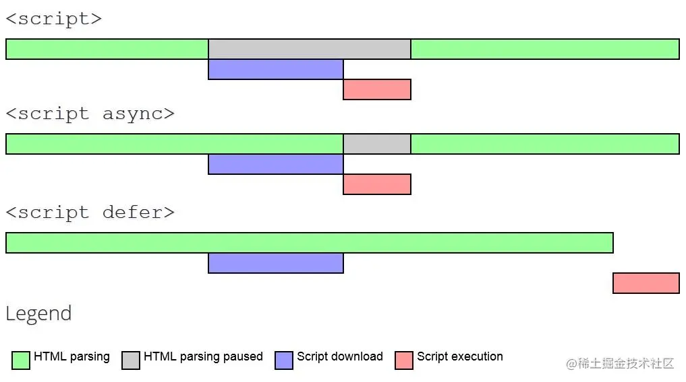

# HTML 基础


## 文档模式（DOCTYPE）

IE5.5 发明了**文档模式**的概念，即可以使用 DOCTYPE 切换文档模式。最初的文档模式有两种：**混杂模式（quirks mode）**和**标准模式（standards mode）**。前者让 IE 像 IE5 一样（支持一些非标准的特性），后者让 IE 具有兼容标准的行为。虽然这两种模式的主要区别只体现在通过 CSS 渲染的内容方面，但对 JavaScript 也有一些关联影响，或称为副作用。

随着浏览器的普遍实现，又出现了第三种文档模式：**准标准模式（almost standards mode）**。这种模式下的浏览器支持很多标准的特性，但是没有标准规定得那么严格。主要区别在于如何对待图片元素周围的空白（在表格中使用图片时最明显）。

### 开启声明

#### 混杂模式/怪异模式

混杂模式在所有浏览器中都以**省略文档开头的 DOCTYPE** 声明作为开关。这种约定并不合理，因为混杂模式在不同浏览器中的差异非常大，不使用黑科技基本上就没有浏览器一致性可言。

#### 标准模式

标准模式通过下列几种文档类型声明开启：

```html
<!-- HTML 4.01 Strict -->
<!DOCTYPE html PUBLIC "-//W3C//DTD HTML 4.01//EN" "http://www.w3.org/TR/html4/strict.dtd">

<!-- XHTML 1.0 Strict -->
<!DOCTYPE html PUBLIC "-//W3C//DTD XHTML 1.0 Strict//EN" "http://www.w3.org/TR/xhtml1/DTD/xhtml1-strict.dtd">

<!-- HTML5 -->
<!DOCTYPE html>
```

#### 准标准模式

准标准模式通过**过渡性**文档类型（Transitional）和**框架集**文档类型（Frameset）来触发：

```html
<!-- HTML 4.01 Transitional -->
<!DOCTYPE html PUBLIC "-//W3C//DTD HTML 4.01 Transitional//EN" "http://www.w3.org/TR/html4/loose.dtd">

<!-- HTML 4.01 Frameset -->
<!DOCTYPE html PUBLIC "-//W3C//DTD HTML 4.01 Frameset//EN" "http://www.w3.org/TR/html4/frameset.dtd">

<!-- XHTML 1.0 Transitional -->
<!DOCTYPE html PUBLIC "-//W3C//DTD XHTML 1.0 Transitional//EN" "http://www.w3.org/TR/xhtml1/DTD/xhtml1-transitional.dtd">

<!-- XHTML 1.0 Frameset -->
<!DOCTYPE html PUBLIC "-//W3C//DTD XHTML 1.0 Frameset//EN" "http://www.w3.org/TR/xhtml1/DTD/xhtml1-frameset.dtd">
```

准标准模式与标准模式非常接近，很少需要区分。人们在说到“标准模式”时，可能指其中任何一个。而对文档模式的检测也不会区分它们。

### 历史

在 HTML 的形成期，web 标准还没有达成一致。浏览器供应商会以他们想要的方式创建新的特性。人们很少关注竞争性的浏览器。

其结果是，web 开发者不得不选择一个浏览器来开发他们的网站。这意味着网站在不支持的浏览器中无法很好地呈现。这种情况不能再继续下去了。

W3C（万维网联盟）制定了一套 web 标准来处理这种情况。所有的浏览器供应商和 web 开发人员都应该遵守这些标准。这将确保网站在不同的浏览器上都能很好地呈现。

该标准所要求的变化与一些现有的做法有很大的不同。遵循这些标准会破坏现有的不符合标准的网站。

为了解决这个问题，供应商开始在他们的浏览器中设置渲染模式。web 开发者需要在 HTML 文档的顶部添加一个 DOCTYPE 声明。DOCTYPE 声明将**告诉浏览器对该文档使用何种渲染模式**。

各个浏览器通常有三种不同的渲染模式：

- 完全标准模式是根据 W3C 网络标准来渲染页面。
- 怪异模式以不符合标准的方式渲染页面。
- 准标准模式接近于完全标准模式，但具有支持少量怪异的特性。

在现代的 HTML5 时代，web 标准在所有主要的浏览器中都得到了充分的实施。网站一般都是以符合标准的方式开发的。正因为如此，**HTML5 DOCTYPE 声明的存在只是为了告诉浏览器以完全标准模式来渲染文档**。

---

个人总结，在 web 非标准到标准的过渡时期，浏览器厂商用 DOCTYPE 来与开发者交互，从而保证任何 html（非标准/标准） 都能在逐步支持标准特性的浏览器中正常渲染。

---

参考

[HTML 中的 DOCTYPE 声明是什么？](https://www.freecodecamp.org/chinese/news/what-is-the-doctype-declaration-in-html/)

[将 VS Code 打造成一个体验舒适的 Markdown 编辑器](https://blog.cxplay.org/works/vscode-to-markdown-editor/#%E5%89%8D%E8%A8%80)

## script 的 async 与 defer 属性

\<script\> - HTML 解析中断，脚本被提取并立即执行。执行结束后，HTML 解析继续。

\<script async\> - 脚本的提取、执行的过程与 HTML 解析过程并行，脚本执行完毕可能在 HTML 解析完毕之前。
当脚本与页面上其他脚本独立时，可以使用 async，比如用作页面统计分析。

\<script defer\> - 脚本仅提取过程与 HTML 解析过程并行，脚本的执行将在 HTML 解析完毕后但在 DOMContentLoaded 事件之前进行。如果有多个含 defer 的脚本，脚本的执行顺序将按照在 document 中出现的位置，从上到下顺序执行。

注意：没有 src 属性的脚本，async 和 defer 属性会被忽略。

可参考 [script-async-defer](https://zh.javascript.info/script-async-defer)



## iframe

优点

- 可以在页面上独立显示一个页面或者内容,不会与页面其他元素产生冲突。
- 可以在多个页面中重用同一个页面或者内容,可以减少代码的冗余。
- 加载是异步的,页面可以在不等待 iframe 加载完成的情况下进行展示。
- 方便地实现跨域访问

缺点

- 搜索引擎可能无法正确解析 iframe 中的内容
- 会阻塞主页面的 onload 事件
- 和主页面共享连接池,影响页面并行加载

## cookie/sessionStorage(HTML5)/localStorage(HTML5)

| 特点\存储类型                                       | cookie                                             | localStorage | sessionStorage | IndexedDB |
| --------------------------------------------------- | -------------------------------------------------- | ------------ | -------------- | --------- |
| 在当前浏览器会话（browser sessions） 中是否保持不变 | 取决于是否设置了过期时间                           | 是           | 否             | 是        |
| 由谁初始化                                          | 客户端或服务器，服务器可以使用 Set-Cookie 请求头。 | 客户端       | 客户端         | 客户端    |
| 是否随着每个 HTTP 请求发送给服务器                  | 是，Cookies 会通过 Cookie 请求头，自动发送给服务器 | 否           | 否             | 否        |
| 容量（每个域名）                                    | 4kb                                                | 5MB          | 5MB            | 5M        |
| 过期时间                                            | 手动设置                                           | 永不过期     | 当前页面关闭时 | 永不过期  |
| 访问权限                                            | 任意窗口                                           | 任意窗口     | 当前页面窗口   | 任意窗口  |
| 存储内容（不要存储敏感信息）                        | 字符串                                             | 字符串       | 字符串         | 对象      |

## 对于 Web 标准以及 W3C 的理解

Web 标准简单来说可以分为结构、表现、行为。

- 结构是由 HTML 各种标签组成，简单来说就是 body 里面写入标签是为了页面的结构。
- 表现指的是 CSS 层叠样式表，通过 CSS 可以让我们的页面结构标签更具美感。
- 行为指的是页面和用户具有一定的交互，这部分主要由 JS 组成

W3C，全称：world wide web consortium 是一个制定各种标准的非盈利性组织，也叫万维网联盟，标准包括 HTML、CSS、ECMAScript 等等，web 标准的制定有很多好处，比如说：

- 可以统一开发流程，统一使用标准化开发工具（VSCode、WebStorm、Sublime），方便多人协作
- 学习成本降低，只需要学习标准就行，否则就要学习各个浏览器厂商标准
- 跨平台，方便迁移到不同设备
- 降低代码维护成本

## 视口

- 视口分类: 视觉视口（visual viewport）/布局视口（layout viewport）定义与区别
- 视口的意义
- 在 CSS、SVG 和移动设备方面的影响

### 视口定义

视口代表当前可见的计算机图形区域。在 Web 浏览器术语中，通常与浏览器窗口相同，但不包括浏览器的 UI/菜单栏等——即指你正在浏览的文档的那一部分。

**概括地说，视口基本上是当前文档的可见部分。**

#### 视口大小可变

查询视口大小和其他类似的长度属性的 DOM 属性：

- 文档的 Element.clientWidth 是指一个文档使用 CSS pixels 单位表示的内部宽度，包括其 padding（不包括 border、margin 或垂直滚动条）。**这就是视口的宽度**。
- Window.innerWidth 是用 CSS 像素单位表示的浏览器窗口的视口宽度，包括垂直滚动条。
- Window.outerWidth 是指包括了浏览器外边框的窗口宽度。


##### 布局视口

Window.innerWidth 和 Window.outerWidth 组成的区域

##### 视觉视口

指当前浏览器中可见的部分，并且可以变化。当使用双指缩放，或键盘在手机上弹出的时候，或者之前隐藏的地址栏变得可见的时候，视觉视口缩小了，但是布局视口却保持不变。

视觉视口，不包括屏幕键盘，缩放外的区域。视觉视口要么跟布局视口相同，要么更小。

##### CSS

在 CSS 中，基于视口大小的长度单位。1vh 单位是 1% 布局视口的高度，vw 单位与此类似。

##### iframe

对于一个 iframe 来说，视觉视口是其内部高度和宽度的大小而不是其父文档的大小。你可以为其高度和宽度设置任意数值，但过大的值可能会使 iframe 部分内容超出视口导致超出部分不可见。

注意的是，当你在 CSS 中使用 vw 和 vh 设置 iframe 的样式时，1vh 表示的是 iframe 高度的 1%，但 1vw 表示的则是 document 宽度的 1%。

##### SVG

在 SVG 文档中，视口即 SVG 图片的可视区域。同样，你也可以为 SVG 设置任何高度和宽度，但不恰当的大小可能无法显示整个 SVG 图片。在 SVG 中的可见部分被称为这个 SVG 的视口。你可以使用 \<svg\> 上的 width 和 height 属性来修改 SVG 的视口大小。

```html
<svg height="300" width="400"></svg>
```

在这个示例中，这个 SVG 的视口长宽比被设置为了 3:4，默认情况下宽为 400 像素，高为 300 像素。

### [移动设备的视口 meta-viewport](https://developer.mozilla.org/zh-CN/docs/Web/CSS/Viewport_concepts)

对于各种不同形状，不同设备像素比移动设备，其浏览器的视口（窗口中显示网页信息的区域）不一定与渲染页面大小相同。移动设备的视口的默认值为 980px，一般情况下都要比这些设备的屏幕尺寸要大。

为了让页面能够全部展示，这些浏览器在渲染时会对页面进行缩放。比如在一个宽 320px 的移动设备显示一个视觉视口宽为 980px 的页面，移动设备浏览器会对这个页面进行缩放直至其视觉视口宽度为 320px（具体取决于浏览器实现）。但直接缩放页面会导致页面字体变小，使得缩放后的页面显示效果都不会很理想。

如果开发者想让移动端浏览器使用屏幕宽度作为视口替换默认的 980px 宽度视口，则可以在 HTML 的头部添加以下标签：

```html
<meta name="viewport" content="width=device-width, initial-scale=1, maximum-scale=1" />
```

这里 width 属性指的是视口宽度，现在视口的宽度被设置为了设备的屏幕宽度，即文档视口宽度大小与设备宽度大小 100% 对应（转换为 CSS 像素值相同）。

除了 width 属性外，还有 initial-scale、maximum-scale、minimum-scale，以及 user-scalable 属性可供设置。这些属性分别设置了文档的初始缩放比例、最大缩放比例、最小缩放比例以及是否允许用户进行缩放操作。但这些属性的默认值已经很好了，开发时可以忽略掉这些属性。

其中，content 参数有以下几种：

width viewport ：宽度(数值/device-width)
height viewport ：高度(数值/device-height)
initial-scale ：初始缩放比例
maximum-scale ：最大缩放比例
minimum-scale ：最小缩放比例
user-scalable ：是否允许用户缩放(yes/no）
