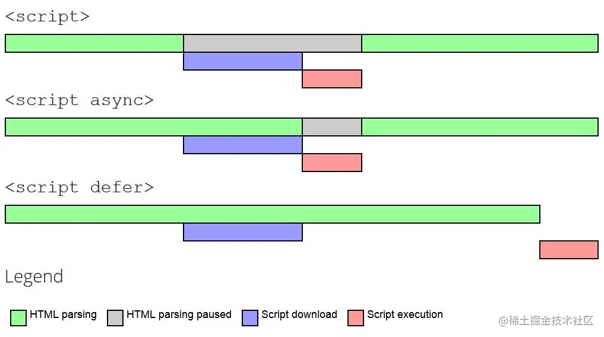
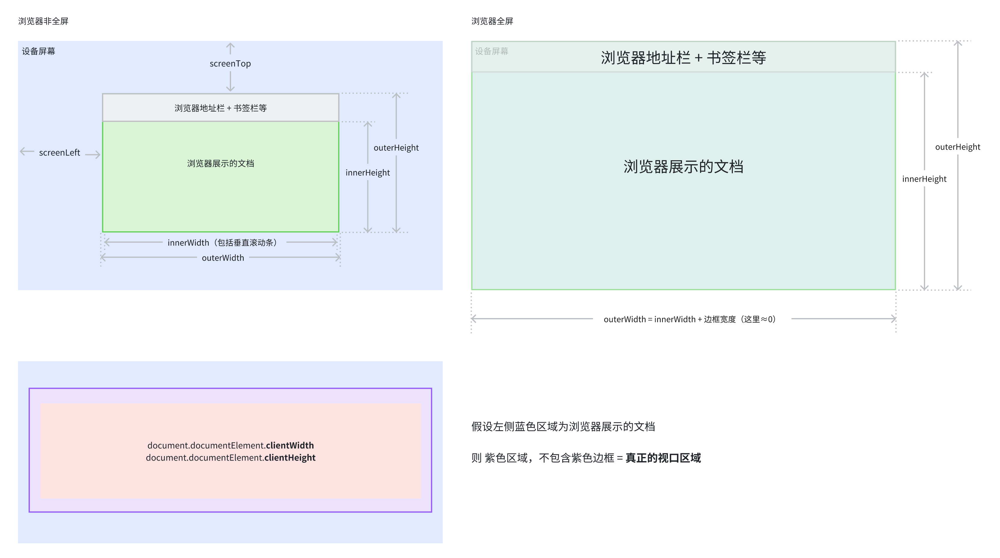
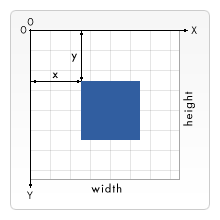

import { SelfUnderstanding, InterviewQuestion } from '@site/src/components/MDX';
import TagTable from '@site/src/components/html/tag-table';
import CodeLive from '@site/src/components/CodeLive';
import Tabs from '@theme/Tabs';
import TabItem from '@theme/TabItem';
import { Divider, Collapse } from "@arco-design/web-react";


# HTML

## 文档模式

IE5.5 发明了**文档模式**的概念，即可以使用 DOCTYPE 切换文档模式。最初的文档模式有两种：**混杂模式（quirks mode）**和**标准模式（standards mode）**。前者让 IE 像 IE5 一样（支持一些非标准的特性），后者让 IE 具有兼容标准的行为。虽然这两种模式的主要区别只体现在通过 CSS 渲染的内容方面，但对 JavaScript 也有一些关联影响，或称为副作用。

随着浏览器的普遍实现，又出现了第三种文档模式：**准标准模式（almost standards mode）**。这种模式下的浏览器支持很多标准的特性，但是没有标准规定得那么严格。主要区别在于如何对待图片元素周围的空白（在表格中使用图片时最明显）。

### 开启声明

#### 混杂模式/怪异模式

混杂模式在所有浏览器中都以**省略文档开头的 DOCTYPE** 声明作为开关。这种约定并不合理，因为混杂模式在不同浏览器中的差异非常大，不使用黑科技基本上就没有浏览器一致性可言。

#### 标准模式

标准模式通过下列几种文档类型声明开启：

```html
<!-- HTML 4.01 Strict -->
<!DOCTYPE html PUBLIC "-//W3C//DTD HTML 4.01//EN" "http://www.w3.org/TR/html4/strict.dtd">

<!-- XHTML 1.0 Strict -->
<!DOCTYPE html PUBLIC "-//W3C//DTD XHTML 1.0 Strict//EN" "http://www.w3.org/TR/xhtml1/DTD/xhtml1-strict.dtd">

<!-- HTML5 -->
<!DOCTYPE html>
```

#### 准标准模式

准标准模式通过**过渡性**文档类型（Transitional）和**框架集**文档类型（Frameset）来触发：

```html
<!-- HTML 4.01 Transitional -->
<!DOCTYPE html PUBLIC "-//W3C//DTD HTML 4.01 Transitional//EN" "http://www.w3.org/TR/html4/loose.dtd">

<!-- HTML 4.01 Frameset -->
<!DOCTYPE html PUBLIC "-//W3C//DTD HTML 4.01 Frameset//EN" "http://www.w3.org/TR/html4/frameset.dtd">

<!-- XHTML 1.0 Transitional -->
<!DOCTYPE html PUBLIC "-//W3C//DTD XHTML 1.0 Transitional//EN" "http://www.w3.org/TR/xhtml1/DTD/xhtml1-transitional.dtd">

<!-- XHTML 1.0 Frameset -->
<!DOCTYPE html PUBLIC "-//W3C//DTD XHTML 1.0 Frameset//EN" "http://www.w3.org/TR/xhtml1/DTD/xhtml1-frameset.dtd">
```

准标准模式与标准模式非常接近，很少需要区分。人们在说到“标准模式”时，可能指其中任何一个。而对文档模式的检测也不会区分它们。

<SelfUnderstanding>
在 web 非标准到标准的过渡时期，浏览器厂商用 DOCTYPE 来与开发者交互，从而保证任何 html（非标准实现/标准实现） 都能在逐步支持标准特性的浏览器中正常渲染。
</SelfUnderstanding>

<Collapse defaultActiveKey={['history']}>
<Collapse.Item header="历史" name="history">

在 HTML 的形成期，web 标准还没有达成一致。浏览器供应商会以他们想要的方式创建新的特性。人们很少关注竞争性的浏览器。

其结果是，web 开发者不得不选择一个浏览器来开发他们的网站。这意味着网站在不支持的浏览器中无法很好地呈现。这种情况不能再继续下去了。

W3C（万维网联盟）制定了一套 web 标准来处理这种情况。所有的浏览器供应商和 web 开发人员都应该遵守这些标准。这将确保网站在不同的浏览器上都能很好地呈现。

该标准所要求的变化与一些现有的做法有很大的不同。遵循这些标准会破坏现有的不符合标准的网站。

为了解决这个问题，供应商开始在他们的浏览器中设置渲染模式。web 开发者需要在 HTML 文档的顶部添加一个 DOCTYPE 声明。DOCTYPE 声明将**告诉浏览器对该文档使用何种渲染模式**。

各个浏览器通常有三种不同的渲染模式：

- 完全标准模式是根据 W3C 网络标准来渲染页面。
- 怪异模式以不符合标准的方式渲染页面。
- 准标准模式接近于完全标准模式，但具有支持少量怪异的特性。

在现代的 HTML5 时代，web 标准在所有主要的浏览器中都得到了充分的实施。网站一般都是以符合标准的方式开发的。正因为如此，**HTML5 DOCTYPE 声明的存在只是为了告诉浏览器以完全标准模式来渲染文档**。

</Collapse.Item>
</Collapse>


参考

[HTML 中的 DOCTYPE 声明是什么？](https://www.freecodecamp.org/chinese/news/what-is-the-doctype-declaration-in-html/)

[将 VS Code 打造成一个体验舒适的 Markdown 编辑器](https://blog.cxplay.org/works/vscode-to-markdown-editor/#%E5%89%8D%E8%A8%80)

## async/defer

\<script\>

HTML 解析中断，脚本被提取并立即执行。执行结束后，HTML 解析继续。

\<script async\>

脚本的提取、执行的过程与 HTML 解析过程并行，脚本执行完毕可能在 HTML 解析完毕之前。

当脚本与页面上其他脚本独立时，可以使用 async，比如用作页面统计分析。

\<script defer\>

脚本仅提取过程与 HTML 解析过程并行，脚本的执行将在 HTML 解析完毕后但在 DOMContentLoaded 事件之前进行。

如果有多个含 defer 的脚本，脚本的执行顺序将按照在 document 中出现的位置，从上到下顺序执行。

注意：没有 src 属性的脚本，async 和 defer 属性会被忽略。

可参考 [script-async-defer](https://zh.javascript.info/script-async-defer)



<pre>
  <b>Input: </b>1 2 3 4{'\n'}
  <b>Output: </b>"366300745"{'\n'}
</pre>
<CodeLive code={`
<div>
<p>...content before script...</p>

<script src="https://javascript.info/article/script-async-defer/long.js?speed=1"></script>
<p>...content after script...</p>
</div>
`} />

<Tabs>
<TabItem value='defer' label='defer'>
```jsx live
function Demo() {
  const [count, setCount] = useState(0);
  useEffect(() => {
    const callback = () => alert("DOM ready after defer!");
    document.addEventListener("DOMContentLoaded", callback);
    return () => {
      document.removeEventListener("DOMContentLoaded", callback);
    };
  }, []);
  return (
    <>
      <button onClick={() => setCount(count + 1)}>点击重新渲染组件 {count}</button>
      <p>...content before script...</p>
      {/* 脚本执行保持相对顺序 */}
      {/* 当我们需要先加载 JavaScript 库，然后再加载依赖于它的脚本时，这可能会很有用。 */}
      <script defer src="https://javascript.info/article/script-async-defer/long.js"></script>
      <script defer src="https://javascript.info/article/script-async-defer/small.js"></script>
      {/* 立即可见 */}
      <p>...content after script...</p>
    </>
  );
}
```
</TabItem>
<TabItem value='async' label='async'>
```jsx live
function Demo() {
  const [count, setCount] = useState(0);
  return (
    <>
      <button onClick={() => setCount(count + 1)}>点击重新渲染组件 {count}</button>
      <p>...content before script...</p>
      <script
        async
        src="https://javascript.info/article/script-async-defer/long.js?speed=1"
      ></script>
      {/* 立即可见 */}
      <p>...content after script...</p>
    </>
  );
}
```
</TabItem>
<TabItem value='block' label='加载阻塞'>
```jsx live
function Demo() {
  const [count, setCount] = useState(0);
  return (
    <>
      <button onClick={() => setCount(count + 1)}>点击重新渲染组件 {count}</button>
      <p>...content before script...</p>
      
      {/* 浏览器解析到 script 标签, 停止继续构建 DOM, 阻塞页面 */}
      <script src="https://javascript.info/article/script-async-defer/long.js?speed=1"></script>

      {/* This isn't visible until the script loads, 脚本也不能给其后面的元素添加处理程序等 */}
      <p>...content after script...</p>
    </>
  );
}
```
</TabItem>
<TabItem value='move' label='移动位置'>
```jsx
function Demo() {
  const [count, setCount] = useState(0);
  return (
    <>
      <button onClick={() => setCount(count + 1)}>点击重新渲染组件 {count}</button>
      ...all content is above the script...
      // highlight-next-line
      <script src="https://javascript.info/article/script-async-defer/long.js?speed=1"></script>
    </>
  );
}
```
</TabItem>
</Tabs>


## iframe

优点

- 可以在页面上独立显示一个页面或者内容,不会与页面其他元素产生冲突。
- 可以在多个页面中重用同一个页面或者内容,可以减少代码的冗余。
- 加载是异步的,页面可以在不等待 iframe 加载完成的情况下进行展示。
- 方便地实现跨域访问

缺点

- 搜索引擎可能无法正确解析 iframe 中的内容
- 会阻塞主页面的 onload 事件
- 和主页面共享连接池,影响页面并行加载

## cookie/sessionStorage(HTML5)/localStorage(HTML5)

| 特点\存储类型                                       | cookie                                             | localStorage | sessionStorage | IndexedDB |
| --------------------------------------------------- | -------------------------------------------------- | ------------ | -------------- | --------- |
| 在当前浏览器会话（browser sessions） 中是否保持不变 | 取决于是否设置了过期时间                           | 是           | 否             | 是        |
| 由谁初始化                                          | 客户端或服务器，服务器可以使用 Set-Cookie 请求头。 | 客户端       | 客户端         | 客户端    |
| 是否随着每个 HTTP 请求发送给服务器                  | 是，Cookies 会通过 Cookie 请求头，自动发送给服务器 | 否           | 否             | 否        |
| 容量（每个域名）                                    | 4kb                                                | 5MB          | 5MB            | 5M        |
| 过期时间                                            | 手动设置                                           | 永不过期     | 当前页面关闭时 | 永不过期  |
| 访问权限                                            | 任意窗口                                           | 任意窗口     | 当前页面窗口   | 任意窗口  |
| 存储内容（不要存储敏感信息）                        | 字符串                                             | 字符串       | 字符串         | 对象      |

## 对于 Web 标准以及 W3C 的理解

Web 标准简单来说可以分为结构、表现、行为。

- 结构是由 HTML 各种标签组成，简单来说就是 body 里面写入标签是为了页面的结构。
- 表现指的是 CSS 层叠样式表，通过 CSS 可以让我们的页面结构标签更具美感。
- 行为指的是页面和用户具有一定的交互，这部分主要由 JS 组成

W3C，全称：world wide web consortium 是一个制定各种标准的非盈利性组织，也叫万维网联盟，标准包括 HTML、CSS、ECMAScript 等等，web 标准的制定有很多好处，比如说：

- 可以统一开发流程，统一使用标准化开发工具（VSCode、WebStorm、Sublime），方便多人协作
- 学习成本降低，只需要学习标准就行，否则就要学习各个浏览器厂商标准
- 跨平台，方便迁移到不同设备
- 降低代码维护成本

## 视口

- 视口分类: 视觉视口（visual viewport）/布局视口（layout viewport）定义与区别
- 视口的意义
- 在 CSS、SVG 和移动设备方面的影响

### 视口定义

视口代表当前可见的计算机图形区域。在 Web 浏览器术语中，通常与浏览器窗口相同，但不包括浏览器的 UI/菜单栏等——即指你正在浏览的文档的那一部分。

**概括地说，视口基本上是当前文档的可见部分。**

#### 视口大小可变

查询视口大小和其他类似的长度属性的 DOM 属性：

- 文档的 Element.clientWidth 是指一个文档使用 CSS pixels 单位表示的内部宽度，包括其 padding（不包括 border、margin 或垂直滚动条）。**这就是视口的宽度**。
- Window.innerWidth 是用 CSS 像素单位表示的浏览器窗口的视口宽度，包括垂直滚动条。
- Window.outerWidth 是指包括了浏览器外边框的窗口宽度。



##### 布局视口

Window.innerWidth 和 Window.outerWidth 组成的区域

##### 视觉视口

指当前浏览器中可见的部分，并且可以变化。当使用双指缩放，或键盘在手机上弹出的时候，或者之前隐藏的地址栏变得可见的时候，视觉视口缩小了，但是布局视口却保持不变。

视觉视口，不包括屏幕键盘，缩放外的区域。视觉视口要么跟布局视口相同，要么更小。

##### CSS

在 CSS 中，基于视口大小的长度单位。1vh 单位是 1% 布局视口的高度，vw 单位与此类似。

##### iframe

对于一个 iframe 来说，视觉视口是其内部高度和宽度的大小而不是其父文档的大小。你可以为其高度和宽度设置任意数值，但过大的值可能会使 iframe 部分内容超出视口导致超出部分不可见。

注意的是，当你在 CSS 中使用 vw 和 vh 设置 iframe 的样式时，1vh 表示的是 iframe 高度的 1%，但 1vw 表示的则是 document 宽度的 1%。

##### SVG

在 SVG 文档中，视口即 SVG 图片的可视区域。同样，你也可以为 SVG 设置任何高度和宽度，但不恰当的大小可能无法显示整个 SVG 图片。在 SVG 中的可见部分被称为这个 SVG 的视口。你可以使用 \<svg\> 上的 width 和 height 属性来修改 SVG 的视口大小。

```html
<svg height="300" width="400"></svg>
```

在这个示例中，这个 SVG 的视口长宽比被设置为了 3:4，默认情况下宽为 400 像素，高为 300 像素。

### [移动设备的视口 meta-viewport](https://developer.mozilla.org/zh-CN/docs/Web/CSS/Viewport_concepts)

对于各种不同形状，不同设备像素比移动设备，其浏览器的视口（窗口中显示网页信息的区域）不一定与渲染页面大小相同。移动设备的视口的默认值为 980px，一般情况下都要比这些设备的屏幕尺寸要大。

为了让页面能够全部展示，这些浏览器在渲染时会对页面进行缩放。比如在一个宽 320px 的移动设备显示一个视觉视口宽为 980px 的页面，移动设备浏览器会对这个页面进行缩放直至其视觉视口宽度为 320px（具体取决于浏览器实现）。但直接缩放页面会导致页面字体变小，使得缩放后的页面显示效果都不会很理想。

如果开发者想让移动端浏览器使用屏幕宽度作为视口替换默认的 980px 宽度视口，则可以在 HTML 的头部添加以下标签：

```html
<meta name="viewport" content="width=device-width, initial-scale=1, maximum-scale=1" />
```

这里 width 属性指的是视口宽度，现在视口的宽度被设置为了设备的屏幕宽度，即文档视口宽度大小与设备宽度大小 100% 对应（转换为 CSS 像素值相同）。

除了 width 属性外，还有 initial-scale、maximum-scale、minimum-scale，以及 user-scalable 属性可供设置。这些属性分别设置了文档的初始缩放比例、最大缩放比例、最小缩放比例以及是否允许用户进行缩放操作。但这些属性的默认值已经很好了，开发时可以忽略掉这些属性。

其中，content 参数有以下几种：

width viewport ：宽度(数值/device-width)
height viewport ：高度(数值/device-height)
initial-scale ：初始缩放比例
maximum-scale ：最大缩放比例
minimum-scale ：最小缩放比例
user-scalable ：是否允许用户缩放(yes/no）


## HTML5 定义

<SelfUnderstanding>
随着 HTML 标准迭代, HTML5 是一个较大变化的标准, 增加了较多的规范和特性, 使得 HTML 的使用与编写更加规范
</SelfUnderstanding>

<Collapse defaultActiveKey={['MDN', 'wiki']}>
<Collapse.Item header="MDN" name="MDN">

[参考链接](https://developer.mozilla.org/en-US/docs/Glossary/HTML5)

术语 HTML5 本质上是指一组现代 Web 技术的流行词汇。这包括 HTML 动态标准，以及用于增强存储、多媒体和硬件访问的 JavaScript API。

你有时会听到“新的 HTML5 元素”，或发现 HTML5 被描述为 HTML 的新版本。HTML5 是以前版本 HTML 的继任者，引入了新的元素和功能，改进或删除了一些现有功能。然而，作为动态标准，HTML 现在没有版本。最新的规范可以在
[html.spec.whatwg.org](https://html.spec.whatwg.org/) 找到。

任何现代网站都应该使用 HTML 文档类型(DOCTYPE)——这将确保你使用的是最新版本的 HTML。

</Collapse.Item>
<Collapse.Item header="维基百科" name="wiki">

[参考链接](https://zh.wikipedia.org/wiki/HTML5)

HTML5 是 HTML 最新的修订版本，由万维网联盟（W3C）于 2014 年 10 月完成标准制定。目标是取代 1999 年所制定的 HTML 4.01 和 XHTML 1.0 标准，以期能在互联网应用迅速发展的时候，使网络标准达到符合当代的网络需求。

**广义论及 HTML5 时，实际指的是包括 HTML、CSS 和 JavaScript 在内的一套技术组合**。它希望能够减少网页浏览器对于需要插件的丰富性网络应用服务（Plug-in-Based Rich Internet Application，RIA），例如：Adobe Flash、Microsoft Silverlight 与 Oracle JavaFX 的需求，并且提供更多能有效加强网络应用的标准集。

</Collapse.Item>
</Collapse>

**下述均为 HTML5 新特性。**

## 语义化

### 理解语义化


<SelfUnderstanding>
使用正确的 HTML 元素来做正确的工作。

- 利于开发：使代码**结构清晰，可读性高，方便维护**
- 利于 SEO：方便爬虫根据语义标签确定**页面结构**和**关键字**的权重
</SelfUnderstanding>

HTML 应该编写为表示将要填充的数据，而不是基于其默认的演示样式。演示（应该是什么样子），是 CSS 的唯一责任。

写语义标记的好处如下：

- 搜索引擎将其内容视为影响页面搜索排名的重要关键字（参见 [SEO](https://developer.mozilla.org/zh-CN/docs/Glossary/SEO)）。
- 屏幕阅读器可以将其用作指引，帮助视力受损的用户导航页面。
- 比起搜索无休止的带有或不带有语义/命名空间类的 div，找到有意义的代码块显然容易得多。
- 向开发人员建议将要填充的数据类型。
- 语义命名反映了正确的自定义元素/组件命名。
- 默认情况下，绝大多数浏览器的用户代理样式表会赋予语义化标签对应的样式

### 语义化标签

全量语义化[标签](https://developer.mozilla.org/zh-CN/docs/Web/HTML/Element)

<InterviewQuestion>
你在平常工作中使用过哪些语义标签？
</InterviewQuestion>

header, nav, aside, main, section, article, footer, canvas, video, audio

<TagTable />

<Tabs>
<TabItem value="main" label="main">
```jsx live
function Demo() {
  return (
    <main style={{ backgroundColor: "rgb(var(--green-1))", border:'2px solid rgb(var(--blue-5))' }}>
      <p>The Rough-skinned Newt defends itself with a deadly neurotoxin.</p>
      <p>The Rough-skinned Newt defends itself with a deadly neurotoxin.</p>
    </main>
  );
}
```
</TabItem>
<TabItem value="header" label="header">


```jsx live
function Demo() {
  return (
    <header style={{ backgroundColor: "rgb(var(--green-2))" }}>
      <b>header</b>
      <h3>h3 header text</h3>
      <time datetime="2018-07-07">July 7</time>
    </header>
  );
}
```

</TabItem>
<TabItem value="nav" label="nav">
```jsx live
function Demo() {
  return (
     <nav style={{ backgroundColor: "rgb(var(--green-3))" }}>
        <b>nav</b>, 底部 margin 是 ol 元素产生的
        <ol>
          <li>
            <a href="#">Bikes</a>
          </li>
          <li>
            <a href="#">BMX</a>
          </li>
          <li>Jump Bike 3000</li>
        </ol>
      </nav>
  );
}
```
</TabItem>
<TabItem value="article" label="article">
```jsx live
function Demo() {
  return (
     <article style={{ backgroundColor: "rgb(var(--green-4))" }}>
        <h4>2024.08.30</h4>
        <div>rainy</div>
      </article>
  );
}
```
</TabItem>

<TabItem value="section" label="section">
```jsx live
function Demo() {
  return (
    <section style={{ backgroundColor: "rgb(var(--lime-2))" }}>
      <b>section</b>
      <h3>Introduction</h3>
      <p>
        This document provides a guide to help with the important task of choosing the correct
        Apple.
      </p>
    </section>
  );
}
```
</TabItem>
<TabItem value="aside" label="aside">
```jsx live
function Demo() {
  return (
    <aside style={{ backgroundColor: "rgb(var(--lime-3))" }}>
      <p>The Rough-skinned Newt defends itself with a deadly neurotoxin.</p>
    </aside>
  );
}
```
</TabItem>
<TabItem value="details-summary" label="details-summary">
```jsx live
function Demo() {
  return (
    <div>
      <details style={{ backgroundColor: "rgb(var(--lime-4))" }}>
        <b>details</b>
        <summary>Details</summary>
        Something small enough to escape casual notice.
      </details>
      <details>单独的 details 标签</details>
      <summary style={{ backgroundColor: "rgb(var(--lime-5))" }}>单独的 summary 标签, 无三角形旋钮</summary>
    </div>
  );
}
```
</TabItem>
<TabItem value="footer" label="footer">
```jsx live
function Demo() {
  return (
    <footer style={{ backgroundColor: "rgb(var(--green-5))" }}>
      <b>footer</b>
      <div>© 2024 Gillian</div>
    </footer>
  );
}
```
</TabItem>

</Tabs>

#### canvas

> 目标: 学会如何绘制矩形，三角形，直线，圆弧和曲线, 熟悉基本形状

canvas 元素创造了一个固定大小的画布，它公开了一个或多个渲染上下文，其可以用来绘制和处理要展示的内容。我们将会将注意力放在 2D 渲染上下文中。

canvas 起初是空白的。为了展示，首先脚本需要找到渲染上下文，然后在它的上面绘制。

canvas 元素有一个叫做 getContext() 的方法，这个方法是用来获得渲染上下文和它的绘画功能。getContext()接受一个参数，即上下文的类型。

##### 画布栅格 canvas grid

画布栅格（canvas grid）以及坐标空间。上一页中的 HTML 模板中有个宽 150px, 高 150px 的 canvas 元素。

如右图所示，canvas 元素默认被网格所覆盖。通常来说网格中的一个单元相当于 canvas 元素中的一像素。
栅格的起点为左上角（坐标为（0,0））。所有元素的位置都相对于原点定位。所以图中蓝色方形左上角的坐标为距离左边（X 轴）x 像素，距离上边（Y 轴）y 像素（坐标为**(x,y)**）。
在课程的最后我们会平移原点到不同的坐标上，旋转网格以及缩放。现在我们还是使用原来的设置。

  

##### 绘制矩形

不同于 SVG，canvas 只支持两种形式的图形绘制：**矩形**和**路径**（由一系列点连成的线段）。所有其他类型的图形都是通过一条或者多条路径组合而成的。不过，我们拥有众多路径生成的方法让复杂图形的绘制成为了可能。

首先，我们回到矩形的绘制中。canvas 提供了三种方法绘制矩形：
```js
fillRect(x, y, width, height)
```
绘制一个填充的矩形
```js
strokeRect(x, y, width, height)
```
绘制一个矩形的边框
```js
clearRect(x, y, width, height)
```
清除指定矩形区域，让清除部分完全透明。

上面提供的方法之中每一个都包含了相同的参数。x 与 y 指定了在 canvas 画布上所绘制的矩形的左上角（相对于原点）的坐标。width 和 height 设置矩形的尺寸。

##### 绘制路径

图形的基本元素是路径。路径是通过不同颜色和宽度的线段或曲线相连形成的不同形状的点的集合。一个路径，甚至一个子路径，都是闭合的。使用路径绘制图形需要一些额外的步骤。

首先，你需要创建路径起始点。
然后你使用画图命令去画出路径。
之后你把路径封闭。
一旦路径生成，你就能通过描边或填充路径区域来渲染图形。
以下是所要用到的函数：

beginPath()
新建一条路径，生成之后，图形绘制命令被指向到路径上生成路径。

closePath()
闭合路径之后图形绘制命令又重新指向到上下文中。

stroke()
通过线条来绘制图形轮廓。

fill()
通过填充路径的内容区域生成实心的图形。

**生成路径的步骤:**

1. beginPath()。本质上，路径是由很多子路径构成，这些子路径都是在一个列表中，所有的子路径（线、弧形、等等）构成图形。而每次这个方法调用之后，列表清空重置，然后我们就可以重新绘制新的图形。
> 备注：当前路径为空，即调用 beginPath() 之后，或者 canvas 刚建的时候，第一条路径构造命令通常被视为是 moveTo()，无论实际上是什么。出于这个原因，你几乎总是要在设置路径之后专门**指定你的起始位置**。
2. 调用函数指定绘制路径

3. 闭合路径 closePath(), 不是必需的。这个方法会通过绘制一条从当前点到开始点的直线来闭合图形。如果图形是已经闭合了的，即当前点为开始点，该函数什么也不做。
> 备注：当你调用 fill() 函数时，所有没有闭合的形状都会自动闭合，所以你不需要调用 closePath() 函数, 但是**调用 stroke() 时不会自动闭合**。

##### 移动笔触

moveTo(x, y)
将笔触移动到指定的坐标 x 以及 y 上。当 canvas 初始化或者beginPath()调用后，你通常会使用moveTo()函数设置起点。

##### 绘制直线

lineTo(x, y)
绘制一条从当前位置到指定 x 以及 y 位置的直线。

该方法有两个参数：x 以及 y，代表坐标系中直线结束的点。开始点和之前的绘制路径有关，之前路径的结束点就是接下来的开始点，以此类推。开始点也可以通过moveTo()函数改变。

<Tabs>

<TabItem value="rect" label="绘制矩形">
```jsx live
function MediaTag(props) {
  useEffect(() => {
    const canvas = document.getElementById("myCanvas-rect"); // 得到 DOM 对象
    if (canvas.getContext) { // 检查支持性
      const ctx = canvas.getContext("2d"); // 访问绘画上下文 和 它的绘画功能

      ctx.fillStyle = "rgb(200,0,0)";
      ctx.fillRect(5, 5, 20, 30);

      ctx.fillStyle = "rgba(0, 0, 200, 0.5)"; // 有 alpha 透明度
      ctx.fillRect(15, 15, 20, 40);

      ctx.fillStyle = "rgba(200, 100, 240, 0.5)";
      ctx.fillRect(40, 10, 80, 80);
      ctx.clearRect(50, 15, 60, 60);
      ctx.strokeRect(60, 20, 30, 30);
    }
  }, []);

  return (
    <div>
      <canvas id="myCanvas-rect" width="200" height="100" style={{ border: '2px solid black' }}></canvas>
    </div>
  );
}
```
</TabItem>
<TabItem value="path" label="绘制路径">
```jsx live
function MediaTag(props) {
  useEffect(() => {
    const canvas = document.getElementById("myCanvas-line"); // 得到 DOM 对象
    if (canvas.getContext) { // 检查支持性
      const ctx = canvas.getContext("2d"); // 访问绘画上下文 和 它的绘画功能
      ctx.beginPath();
      // 设置图形轮廓的颜色
      ctx.strokeStyle = "green";
      // 绘制直线
      ctx.moveTo(10, 20); // 起点
      ctx.lineTo(20, 30); // 终点
      ctx.stroke();
    }
  }, []);

  return (
    <div>
      <canvas id="myCanvas-line" width="300" height="120" style={{ border: '2px solid black' }}></canvas>
    </div>
  );
}
```
</TabItem>

<TabItem value="triangle" label="绘制三角形">
```jsx live
function MediaTag(props) {
  useEffect(() => {
    const canvas = document.getElementById("myCanvas-triangle"); // 得到 DOM 对象
    if (canvas.getContext) { // 检查支持性
      const ctx = canvas.getContext("2d"); // 访问绘画上下文 和 它的绘画功能

      // 绘制三角形
      ctx.beginPath();
      ctx.fillStyle = "green";
      ctx.moveTo(75, 50); // 设置起点
      ctx.lineTo(100, 75); // 绘制直线
      ctx.lineTo(100, 25);
      ctx.fill();

      // 填充三角形
      ctx.beginPath();
      ctx.fillStyle = "pink";
      ctx.moveTo(15, 15);
      ctx.lineTo(105, 15);
      ctx.lineTo(15, 105);
      ctx.fill(); // 路径自动闭合

      // 描边三角形
      ctx.beginPath();
      ctx.strokeStyle = "red";
      ctx.moveTo(125, 125);
      // 两条线段绘制后构成三角形的两条边
      ctx.lineTo(125, 45);
      ctx.lineTo(45, 125);
      ctx.closePath(); // 调用 closePath() 手动闭合路径 否则只绘制两条线段 不是完整的三角形
      ctx.stroke();
    }
  }, []);

  return (
    <div>
      <canvas id="myCanvas-triangle" width="300" height="150" style={{ border: '2px solid black' }}></canvas>
    </div>
  );
}
```
</TabItem>

<TabItem value="laugh" label="绘制笑脸">
```jsx live
function MediaTag(props) {
  useEffect(() => {
    const canvas = document.getElementById("myCanvas-laugh"); // 得到 DOM 对象
    if (canvas.getContext) { // 检查支持性
      const ctx = canvas.getContext("2d"); // 访问绘画上下文 和 它的绘画功能

      // 如果你想看到连续的线，你可以移除调用的 moveTo()
      ctx.beginPath();
      ctx.arc(75, 75, 50, 0, Math.PI * 2, true); // 绘制圆弧
      ctx.moveTo(110, 75);
      ctx.arc(75, 75, 35, 0, Math.PI, false); // 口 (顺时针)
      ctx.moveTo(65, 65);
      ctx.arc(60, 65, 5, 0, Math.PI * 2, true); // 左眼
      ctx.moveTo(95, 65);
      ctx.arc(90, 65, 5, 0, Math.PI * 2, true); // 右眼
      ctx.stroke();
    }
  }, []);

  return (
    <div>
      <canvas id="myCanvas-laugh" width="300" height="200" style={{ border: '2px solid black' }}></canvas>
    </div>
  );
}
```
</TabItem>

</Tabs>


## 增强表单

为 input 增加 color、email、date、range 等类型

## 存储

提供了 sessionStorage 、localStorage 和离线存储，通过这些存储方式方便数据在客户端的存储和获取

## 多媒体

规定了音频和视频元素 audio 和 vedio

## 其他

地理定位、canvas 画布、拖放、多线程编程的 web workers 和 websocket 协议
