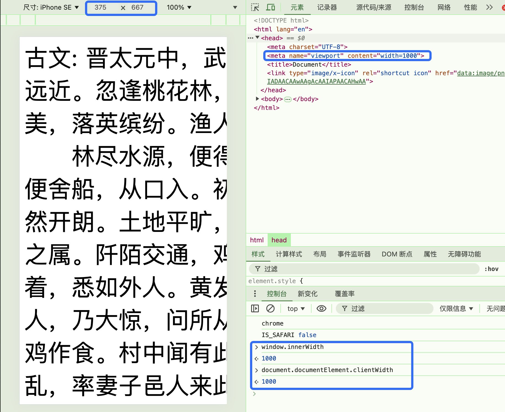

# meta 设置 viewport

## meta 标签

meta标签里面的内容，主要是提供关于这个HTML页面的元信息的。简单点说，就是你用这些信息来告诉浏览器，应该如何解析这个HTML文件。比如
```html
<meta charset="utf-8">
```
这个标签是告诉浏览器，该HTML文件的字符编码格式是utf-8。当浏览器解析该HTML文件时，由于meta标签位于头部，会先获取到这个信息，然后浏览器就用这个utf-8编码来解析这个HTML文件中的字符。

当然，除了上面这种简单的格式外，meta标签更常见的是这种name + content的形式：

```html
<meta name="format-detection" content="telephone=no" />
```
name 属性的值告诉浏览器，这个meta标签设置的是format-detection，其具体值是content中的telephone=no，即忽略将数字识别成电话号码。

## 设置 viewport

我们所做的适配，就是要调整layout viewport的大小，而用meta标签就可以调整layout viewport的大小。上网去搜移动端适配，一定会看到下面这句代码：

```html
<meta name="viewport" content="width=device-width, user-scalable=no, initial-scale=1.0, maximum-scale=1.0, minimum-scale=1.0">
```

"viewport" meta 标签的基本属性如下所示：
| 属性 | 描述 |
| :--- | :--- |
| width | 控制视口的大小。这可以设置为特定像素数（如'width=600'），也可以设置为特殊值device-width，即 100vw，100% 的视口宽度。最小值为 1。最大值为 10000。负值会被忽略。 |
| height | 控制视口的大小。这可以设置为特定像素数（如 width=600），也可以设置为特殊值 device-height，即 100vh，100% 的视口高度。最小值为 1。最大值为 10000。负值会被忽略。 |
| initial-scale | 控制页面首次加载时显示的缩放倍数。最小值是 0.1。最大值是 10。默认值为 1。负值会被忽略。 |
| minimum-scale | 控制页面允许缩小的倍数。最小值是 0.1。最大值是 10。默认值为 1。负值会被忽略。 |
| maximum-scale | 控制页面允许放大的倍数。设置一个低于 3 的值将不具备无障碍访问性。最小值是 0.1。最大值是 10。默认值为 1。负值会被忽略。 |
| user-scalable | 控制是否允许页面上的放大和缩小操作。有效值为 0、1、yes 或 no。默认值为 1，与 yes 相同。将值设置为 0（即与 no 相同）将违反 Web 内容无障碍指南（WCAG）。 |
| interactive-widget | 指定交互式 UI 组件（如虚拟键盘）对页面视口的影响。有效值：resizes-visual、resizes-content 或 overlays-content。默认值：resizes-visual。 |

回到应用场景，我们用这个标签的主要目的是做移动端的适配，一般都是做一个专门为移动端设计的页面。所以，我们在设置layout viewport时，当然希望这个viewport的尺寸等于ideal viewport。
需求已经明确了，接下来看看我们如何利用上面表里的属性来实现。

不设置 viewport mata 样式:

  


### 利用 width

```html
<meta name="viewport" content="width=device-width">
```

这个width，就是用来设置layout viewport的宽度。我们设置其值为device-width，也就是设置成设备的实际宽度。

而ideal viewport的宽度是与设备的宽度相等的，所以，这句代码就把viewport设置成了ideal viewport的大小。

可以分别用`window.innerWidth`和`document.documentElement.clientWidth`查看：
均等于设备宽度。

  

当然，只要你高兴，也可以设置成别的值，比如把宽度设置成1000，那么layout viewport就会比visual viewport大，浏览时会有一个滚动条。
具体实现时，代码上最好加上initial-scale=1.0，防止浏览器对页面进行缩放。

  
  

### 利用 scale

```html
<meta name="viewport" content="initial-scale=1.0">
```

Initial-scale用来设置初次加载页面时layout viewport相对于ideal viewport的大小。具体计算公式是：

```
layout viewport = ideal viewport / scale
scale = ideal viewport / layout viewport
```

需要注意的是，利用scale设置，无论计算出来的layout viewport的值大小如何，最后都会被浏览器自动缩放到与visual viewport大小相等，并不会出现滚动条。

具体看下面的例子，我们设置的红框大小为100x100px，字体大小为32px。

### initial-scale=1.0
设置scale值为1.0，那么layout viewport的大小与ideal viewport大小相等：

  
  

此时红框显示出来的大小就是100px，字体大小也就是32px。

### initial-scale=0.5

设置scale值为0.5，那么layout viewport的大小就是ideal viewport的两倍，即750px：

  


但是浏览器会把layout viewport进行缩放，从而达到与visual viewport大小适配。

对于已经是visual viewport750px的layout viewport，需要缩放到以前的0.5倍，才能正好适配375px。

所以，100px的红框看起来只会有50px的大小，字体也会对应的缩小一半。如果设计图的大小是750px，那么样式大小完全可以按照设计图来写，最后只要设置scale为0.5，视觉上的效果就是缩小后的。

这里用window.innerWidth打印出来的visual viewport大小不对，用screen.width打印出来是对的，具体原因网上也没查到。

### initial-scale=2.0
设置scale的值为2，那么layout viewport的大小就是ideal viewport的一半，即187px：

  

同样的，浏览器会自动缩放。本来是188px的layout viewport，需要放大两倍，才能填满visual viewport。此时，100px的红框会被放大成200px，字体大小会放大到64px。

## 同时使用

width和scale两种方式都可以实现，但是兼容性不同。我们的目的，是为了把layout viewport设置成ideal viewport的大小。为了能兼容所有的设备，就有了下面的方案：

```html
<meta name="viewport" content="width=device-width, user-scalable=no, initial-scale=1.0, maximum-scale=1.0, minimum-scale=1.0">
```

如果两者设置的大小不一样，那么会取较大者。设置width为device-width，然后再设置缩放值为1，就完全限制了layout viewport的大小为visual viewport了。

其他的属性，都是来控制缩放的。其实，设置了maximum-scale=1.0, minimum-scale=1.0就相当于设置了user-scalable=no了。如果不禁用缩放，那么layout viewport的大小在缩放时还是会变的。

## 小结
用viewport的目的，是为了设置layout viewport的大小，从而保证能在移动端设备上合适的显示出来。

参考[移动端适配之三：使用meta标签设置viewport](https://juejin.cn/post/6844903943298891790)