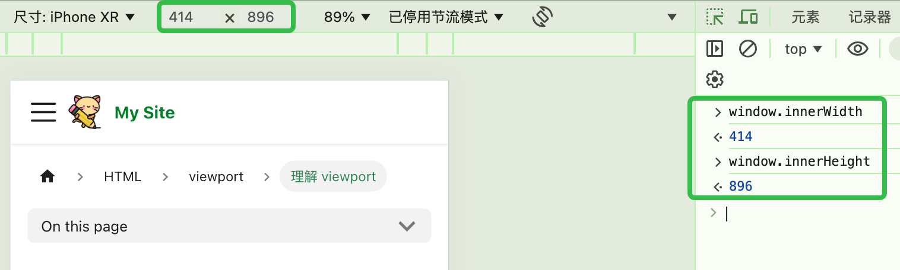
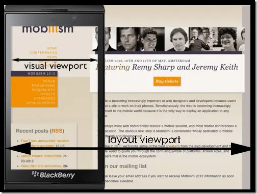

# 理解 viewport

## visual viewport

这个是浏览器给我们用的、能真正用来显示网页内容的区域，可以通过下面的js命令获取：

```js
window.innerWidth
window.innerHeight
```

前端里面能获取到的像素基本上都是CSS像素，所以这个的单位也是CSS像素。

对于iPhone XR，浏览器全屏状态下，其window.innerWidth 的值为 414。

  

像素章节提到`screen.width`和`screen.height`，主要是用来获取**整个屏幕大小**的.

`window.innerWidth`和`window.innerHeight`只是获取**浏览器可用显示区域**的大小，也就是浏览器中间负责显示的部分。
当浏览器全屏时，要去掉状态栏、标签栏、任务栏等区域，当浏览器非全屏时，其值更小。

由于在移动端，浏览器一般都是全屏的，所以大多数情况下`screen.width`与`window.innerWidth`的值相等，也有的博客中说用`screen.width`和`screen.height`来获取visual viewport的大小，就是这个原因。

visual viewport是我们可以直观看到的，不严谨的说，就是差不多等于手机屏幕的大小，偏向于一个物理概念。

## layout viewport

网页最早是出现在电脑上的，像素章节提到，电脑的物理像素可能比手机还要低，但是电脑的设备无关像素（或者说是分辨率吧，更严谨一些）是明显大于手机的设备无关像素的，毕竟电脑的屏幕尺寸远比手机大啊。

那些在电脑上的网页，如果没有经过专门的优化，直接搬到手机上看，那么问题就来了，网页会被挤得变形，相信这种问题大家都遇到过。所以呢，手机厂商为了解决这个问题，设置了一个 layout viewport。

这是一个虚拟的窗口，其大小比手机屏幕大，加载网页时，直接把HTML渲染在这个虚拟的窗口中，这样就不会样式错乱了。在查看的时候，毕竟手机的visual viewport小啊，那就只能通过滚动条来看了。

  

做个比喻，layout viewport就是一张大白纸，HTML的内容就写在这个大白纸上，visual viewport就是一个放大镜，上下左右移动，可以显示其中的一部分。

Layout viewport的大小可以通过`document.documentElement.clientWidth`和`document.document.clientHeight`获取，实际使用中可能会有一些兼容问题，这跟DOCTYPE声明有关。

不同浏览器默认的layout viewport大小不同，常见的有980px、1024px。

## ideal viewport

Layout viewport是为了能将电脑上的网页正确的显示到手机上。当浏览器拿到一个网页时，首先会渲染到这个layout viewport里面。

可是现在有很多网页会针对手机做专门的设计，比如现在的一些H5活动页，设计的尺寸就是在手机上看的。此时如果还是把网页渲染到这个大的layout viewport上，实在是有点不合适了。

所以，还应该有个ideal viewport，这个ideal viewport应该与手机屏幕大小的相同，确切来说，等于visual viewport的大小。把页面渲染到这个ideal viewport里面，就能在visual viewport中完美显示。

## 总结

首先，我们可以假想，layout viewport和ideal viewport都是用来渲染页面的两个盒子，HTML页面渲染在盒子里面，而visual viewport用来查看渲染后的结果的，相当于一个窗口。
我们设置HTML的body为width:100%，那么盒子有多宽，HTML页面就有多宽。layout viewport用来渲染电脑上的页面，所以比较大，而ideal viewport较小，用来渲染专门针对手机设计的页面。

然而，在浏览器的实现中，其实并没有那么多盒子。就只有一个layout viewport的盒子，页面就渲染在这个盒子中。layout viewport默认是比较大的。如果我们希望渲染到ideal viewport的盒子里面，那就只要调整这个layout viewport的大小即可，具体如何调整，将在下一节中介绍。

综上，layout viewport用来承载HTML的渲染，visual viewport是查看渲染结果的窗口，而ideal viewport可以理解成是一种尺寸，其大小等于visual viewport。
调整layout viewport的大小，让其在visual viewport的查看下有最佳效果，就是我们想要的移动端适配。


参考[移动端适配之二：visual viewport、layout viewport和ideal viewport介绍](https://juejin.cn/post/6844903943298875406)

> 和 mdn 关于布局视口和视觉视口的解释不一样，先以 mdn 为准.