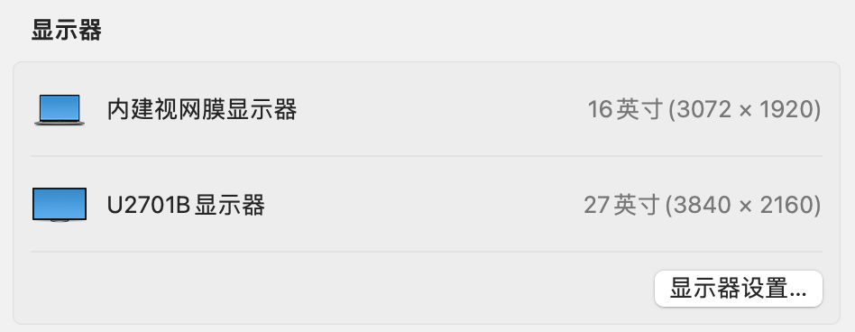
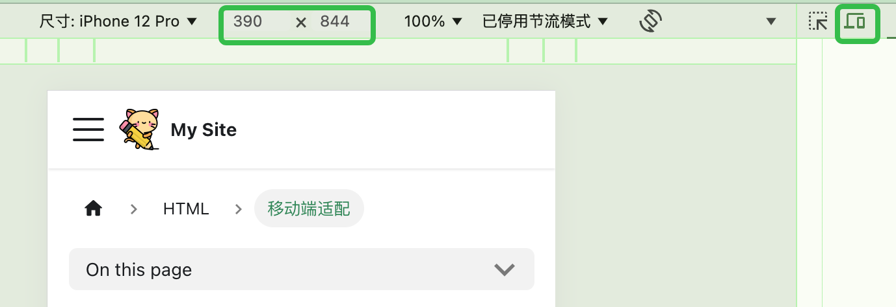

# 移动端适配

## 像素

像素就是点, 或者说 是一个很小的正方形. 经常用像素来描述分辨率

### 屏幕中的分辨率

任何显示设备，如电脑显示器和手机屏幕，其实都是由很多个小点组成的。比如，我的显示器分辨率是 1920x1080，就表示显示器横向一共有 1920 个像素点，纵向一共有 1080 个像素点，每个像素点都可以单独显示一种颜色。于是，所有像素点显示的颜色加起来，就是我们最后看到的效果。
至于**每个像素点是多大，这就跟显示器硬件的性能有关了**。

需要注意的是，**屏幕大小和分辨率的高低并无直接关系**：

相同大小的屏幕，分辨率并不一定就相同
屏幕大的显示设备，分辨率并不一定就高，如 iPhone X 的分辨率高达 2436×1125，就比我用的 21 英寸显示器的 1920x1080 的分辨率还要高

现在常常会提到 4K 显示器，就要求屏幕的横向分辨率达到约 4000 像素，如 3840x2160 或 4096×2160。很明显，对于大小相同的屏幕，分辨率越高，像素点越多，每个像素点也就越小，成本也就越高。但是，分辨率高的最直观感受，就是可以看更高清的图片和视频，显示会更加清晰。

### 图片和视频中的像素

与上面类似，图片和视频中的分辨率，也是描述横向和纵向分辨有多少个像素点。每个像素点表示一种颜色，所有颜色显示出来，就是一张图片。理论上，可以用数字完全描述一张图片，如下面的例子：

```
#ddfd23, #234862 ..... #fab421
#ddfd23, #234862 ..... #fab421
......
#ddfd23, #234862 ..... #fab421
#ddfd23, #234862 ..... #fab421
```

每个像素点上的颜色，都用一个色值表示，如果图片分辨率为 400x300 像素，那么横向就有 400 个值，纵向是 300 个值。

## 物理像素与设备独立像素

对于一台显示器或手机，其实是有 2 个分辨率的，这两个分辨率是不同的，但也是相关的。

### 概念

上面所解释的**屏幕中的分辨率，其实都是物理像素**，也就是厂家在生产显示设备时就决定的实际点的个数。

上面提到，对于不同的设备而言，物理像素点的大小是不一样的，这样就会带来问题：

举个例子，21 英寸显示器的分辨率是 1440x1080，5.8 英寸的 iPhone X 的分辨率是 2436×1125，我用 CSS 画一条线，
其长度是 20px，如果都以物理像素作为度量单位，那么在显示器上看起来正常，在 iPhone X 屏幕上就变得非常小，不是我们想要的结果。

所以呢，为了解决这个问题，还需要一个新的度量单位，这个度量单位必须是与设备无关的，
**采用这个单位，无论在何种设备上，相同长度的线看起来都应该差不多，这就是设备独立像素(device-independent pixels, dips )**。
我们在 CSS 中用的 CSS 像素，其实就是一种设备独立像素，在 Android 或 IOS 开发中，人家就不能叫 CSS 像素了，不过意思还是一样滴~

物理像素可以理解为硬件设备，设备独立像素可以认为是程序员控制显示器的接口，中间会经过操作系统来将设备独立像素转换成物理像素，用实际的物理像素点来显示。
所以，在编程中能获取到的都是设备独立像素，如 CSS 中的获取的所有像素都是设备独立像素，而物理像素对于程序员来说是透明的，咱没法在代码中看到的。至于怎么看，将在下文介绍。
物理像素是在出厂时就决定的，但是设备独立像素其实是可调的。大家用电脑的时候，应该都试过调整分辨率，此时调整的实际就是设备独立像素，比如 Macbook 可以这样[调整分辨率](https://support.apple.com/zh-cn/guide/mac-help/mchl86d72b76/mac)

### 在设备中查看

厂家在宣传自己的产品时，往往会拿物理像素说话，因为物理像素才会代表其工艺水平，才会吸引用户花更多的钱去买。
对于物理像素，一般在产品的官网参数里面都可以看到，也可以在属性中查看。如对于我的Mac笔记本，在关于本机->显示器中可以看到如下的信息，其物理分辨率大小为 3072 x 1920：

  

要查看显示器的**设备独立像素**, 浏览器敲代码

```js
// 4K显示器
screen.width // 1920
screen.height // 1080

// 15寸 MBP
screen.width // 1792
screen.height // 1120
```

对于手机，物理像素可以在手机说明书或者官网的参数配置中查到，而设备独立像素打开控制台选择对应机型后就可以看到：

  

当然，也可以在控制台中用上面的js命令查看。此外，这里也提供一个[网站](https://m2.material.io/resources/devices/), 但是貌似国内手机没收录，具体的机型，大家可以自行百度下，基本都可以查到的。

不管何种设备，一般都满足：设备独立像素 < = 物理像素

### 关系

```js
window.devicePixelRatio = 设备物理像素 / 设备独立像素

// 显示器模式下
window.devicePixelRatio = 2 // 我的4K显示器
window.devicePixelRatio = 2 // 我的15寸 MBP
```

通过`window.devicePixelRatio`，可以知道一个设备独立像素用几个物理像素点来表示。
如iPhone X中，devicePixelRation为3，iPhone6/7/8中devicePixelRatio的为2。当然，devicePixelRation并不一定是整数，也有可能是1.5，2.25这些小数值。

经过我的实际测试，在手机模式下，上面这个公式基本都是成立的，而在电脑显示器上，还有些问题。另外，当我调整电脑显示器的分辨率时，无论调整出来的电脑显示器分辨率为多少，
在我的MacBook上，devicePixelRation的值都为2（理论上，调整电脑显示器的分辨率，即调整了设备独立像素，而物理像素是固定的，所以devicePixelRation的值会跟着改变才对）。

经查，这可能是devicePixelRation在不同平台的定义不同造成的，所以目前，在移动端可以放心的用，在PC端还是慎用。

## 缩放

说完上面的概念，也许会有个疑惑：有一张400x300(物理)的图片，分别放到400x300(物理)和800x600(物理)的显示器上**全屏**显示，会怎么样呢？


- 先来看400x300的显示器，由于是全屏显示，正好图片也是400x300的分辨率，两者相等，于是很愉快的，显示器上一个像素点就显示照片上的一个像素，整个图片完美的显示出来了
- 而在800x600的显示器上全屏时，图片上点的数目不够用了，这时，屏幕上的4个像素点只能显示照片的一个像素点（为什么是4呢，因为一个像素点可以看成是一个正方形，横向和纵向都是2倍，所以2x2=4）。
由于像素已经是最小的单位了，不能再往下分了，所以就只能就近取色，所以最后的图片看起来就会模糊。


这个原理与Retina屏幕显示是一样的。比如，对于一幅400x300的图片，用CSS设定其宽高为400x300，CSS设定的是设备独立像素。
- 在普通屏幕上，CSS指定的400x300像素大小区域正好是400x300个物理像素点，图片完美显示，对应上面的情况一；
- 在Retina屏上，devicePixelRatio为2，CSS指定的400x300像素大小区域有800x600个物理像素点，对应的就是上面的情况2，所以就会有模糊的情况。具体原理可以参考下面的图（来自网络）：
  


为了解决Retina屏幕的显示问题，往往会用更高分辨率的图片来代替，比如对于上面的情况，如果用800x600的图片，那么在Retina屏幕上显示就会非常完美，
但是换到普通屏幕上，问题又来了：显示器上的一个物理像素点要显示照片上的4个像素点，装不下了。
这时候，会自动下采样。下采样之后的，看起来也不会有太大问题，但可能会有点色差或者缺少锐利度。
  

## CSS 的单位

你可能在有的博客上看到，一个像素的长度是一英寸的1/96。这种解释，貌似给了像素这个比较抽象的单位一个直观的感受，但是现在来看，这个只能用来描述CSS像素，不能用来描述物理像素，而且，即使是描述物理像素，也不那么准确了。所以，在这里，有必要介绍一下CSS中的单位，顺便解释一下这个问题。
CSS的单位分两种：绝对长度单位和相对长度单位。

### 绝对长度单位

cm：厘米
mm：毫米
in：英寸
pc(picas):一英寸的1/6
pt(points)：一英寸的1/72
px(pixels)：一英寸的1/96

之所以叫绝对长度单位，是因为在只有普通屏幕的时代，相同的单位无论在何种设备上，显示出来的长度都是一致的，并且1cm就是等于物理长度1厘米。
而后来，由于Retina显示屏的出现，**绝对长度单位里面的“绝对”，是指单位之间关系是绝对固定的**。比如，1in = 72pt和1in = 96px是永远固定不变的。关系不变，就需要选取其中一个作为基准：

- 在打印机设备中，一般是以物理单位作为基准，即1in对应物理单位的1in，此时，1px的长度就是1/96in。所有单位都是与物理长度对应的
- 在显示设备（电脑和手机）中，一般是以像素作为基准的。比如在iPhone X中，设备的宽度是2.79in（物理宽度），屏幕分辨率是1125物理像素，window.devicePixelRatio = 3，
也就是3个物理像素表示一个CSS像素，所以iPhone X宽度的CSS像素是375px。此时，CSS单位的1in表示的实际长度是2.79 / 375 * 96in = 0.71424in，此时，CSS的1in并不表示物理长度1in

之所以这种绝对长度不再绝对，就是因为多倍屛的出现，使得像素点的物理尺寸缩小。于是，CSS也修改了这些单位的定义，目前已经得到大多数设备的支持。关于这一点，可以参加[CSS官方文档](https://www.w3.org/TR/css-values-3/#absolute-lengths)
### 相对长度单位
相对于预定义的长度或特征，一般是相对于字体或者viewport，在移动端适配中有很重要的作用
#### 相对于字体

- ex (x-height)：等于所用字体的小写字母x的高度
- ch (character)：等于所用字体的数字0的宽度
- em：相对于最近父级font-size，所以会有层层嵌套的问题，每一层都是相对于最近父级
- rem ：相对于html标签的font-size

#### 相对于viewport

- vh：viewport高度的1/100
- vw：viewport宽度的1/100
- vmin：viewport宽高较小者的1/100
- vmax：viewport宽高较大者的1/100

## 总结
这里花了很大的篇幅去介绍像素，这个看起来简单实际却有点复杂但又必须弄清楚的东西，为后面的移动端适配做基础。


参考[移动端适配之一：到底什么是像素](https://juejin.cn/post/6844903943290486792)
