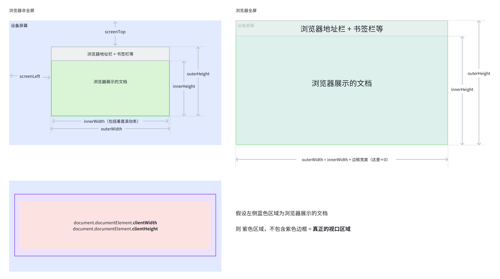

import ShowTable from '@site/src/components/html/show-table';
import CustomRate from '@site/src/components/CustomRate';

#  viewport

1. 是什么: 视口定义/类型/查询方式
2. 为什么: 暂无
3. 怎么用: 视口大小影响 css svg 和移动设备的定义, 在定义一些跟视口宽高强相关的概念中有用, 比如 1vw 1vh 等

## 是什么

> 宏观定义

视口代表当前可见的计算机图形区域。在 Web 浏览器术语中，通常与**浏览器窗口**相同，但不包括浏览器的 UI/菜单栏等——即指你正在浏览的文档的那一部分。

**概括地说，视口基本上是当前文档的可见部分。**

### 视口大小查询

> 详细属性

<ShowTable type='viewport' />

> 缩放

**浏览器缩放**

百分比 ↑ Window.innerWidth ↓ Window.innerHeight ↓ outerWidth&outerHeight 不变

百分比 ↓ Window.innerWidth ↑ Window.innerHeight ↑ outerWidth&outerHeight 不变

**移动设备双指缩放/键盘弹出**

视觉视口缩小, 布局视口不变, 即 Window.innerWidth 和 Window.innerHeight 不变 (待实操)

> 示意图



### 视口类型

Web 浏览器包含两个视口，布局视口和视觉视口。

**布局视口**

Window.innerWidth 和 Window.outerWidth 组成的区域, 缩放后, 变化成新的 CSS 像素大小

**视觉视口**

一句话概括: 布局视口中, 看得到的部分.

> MDN 定义: 指当前浏览器中可见的部分，并且可以变化。当使用双指缩放，或键盘在手机上弹出的时候或者之前隐藏的地址栏变得可见的时候，视觉视口缩小了，但是布局视口却保持不变。
> 
> 视觉视口，不包括屏幕键盘，缩放外的区域。视觉视口要么跟布局视口相同，要么更小。

## 使用场景

### [meta-viewport](https://developer.mozilla.org/zh-CN/docs/Web/CSS/Viewport_concepts)

移动设备的视口. 对于各种不同形状，不同设备像素比移动设备，其浏览器的视口（窗口中显示网页信息的区域）不一定与渲染页面大小相同。移动设备的视口的默认值为 980px，一般情况下都要比这些设备的屏幕尺寸要大。

为了让页面能够全部展示，这些浏览器在渲染时会对页面进行缩放。比如在一个宽 320px 的移动设备显示一个视觉视口宽为 980px 的页面，移动设备浏览器会对这个页面进行缩放直至其视觉视口宽度为 320px（具体取决于浏览器实现）。但直接缩放页面会导致页面字体变小，使得缩放后的页面显示效果都不会很理想。

如果开发者想让移动端浏览器使用屏幕宽度作为视口替换默认的 980px 宽度视口，则可以在 HTML 的头部添加以下标签：

```html
<meta name="viewport" content="width=device-width, initial-scale=1, maximum-scale=1" />
```

这里 width 属性指的是视口宽度，现在视口的宽度被设置为了设备的屏幕宽度，即文档视口宽度大小与设备宽度大小 100% 对应（转换为 CSS 像素值相同）。

其中，content 参数有以下几种, 但这些属性的默认值已经很好了，开发时可以忽略掉这些属性。
- width viewport ：宽度(数值/device-width)
- height viewport ：高度(数值/device-height)
- initial-scale ：初始缩放比例
- maximum-scale ：最大缩放比例
- minimum-scale ：最小缩放比例
- user-scalable ：是否允许用户缩放(yes/no)


### CSS

<CustomRate value={4} />

在 CSS 中，基于视口大小的长度单位。1vh 单位是 1% 布局视口的高度，vw 单位与此类似。

### iframe

<CustomRate value={1} />

对于一个 iframe 来说，视觉视口是其内部高度和宽度的大小而不是其父文档的大小。你可以为其高度和宽度设置任意数值，但过大的值可能会使 iframe 部分内容超出视口导致超出部分不可见。

注意的是，当你在 CSS 中使用 vw 和 vh 设置 iframe 的样式时，1vh 表示的是 iframe 高度的 1%，但 1vw 表示的则是 document 宽度的 1%。

### SVG

<CustomRate value={1} />

在 SVG 文档中，视口即 SVG 图片的可视区域。同样，你也可以为 SVG 设置任何高度和宽度，但不恰当的大小可能无法显示整个 SVG 图片。在 SVG 中的可见部分被称为这个 SVG 的视口。你可以使用 \<svg\> 上的 width 和 height 属性来修改 SVG 的视口大小。

```html
<svg height="300" width="400"></svg>
```

在这个示例中，这个 SVG 的视口长宽比被设置为了 3:4，默认情况下宽为 400 像素，高为 300 像素。

